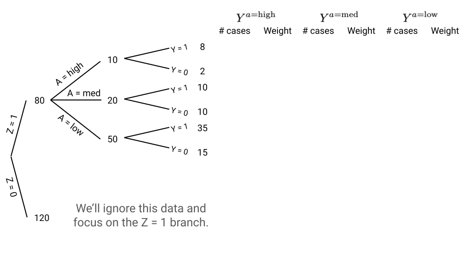

# Assignment 4 {.unnumbered}

```{r a4_setup, echo=FALSE, message=FALSE}
library(dagitty)
```

**Due:** Sunday, 10/11 at midnight on Moodle

**Format:** Please submit a rendered HTML document containing your responses. You can work from [this template](assignment4_YOURNAME.qmd).

## Exercise 1

**Research question:** What is the causal effect of adolescent substance use (specifically marijuana smoking) on adulthood substance use (specifically cigarette smoking)?

We will investigate this question using data from the National Longitudinal Study of Adolescent to Adult Health (Add Health). From the study's [website](https://addhealth.cpc.unc.edu/):

> [Add Health] is a longitudinal study of a nationally representative sample of over 20,000 adolescents who were in grades 7-12 during the 1994-95 school year and have been followed for six waves of data collection to date, most recently in 2022-25. Wave VII began in fall 2026.

```{r eval=FALSE}
addhealth <- read_csv("https://mac-stat.github.io/data/addhealth.csv")

# Encode all variables as categorical variables
# (Age only has 3 values so is essentially categorical)
addhealth <- addhealth |> 
    mutate(across(everything(), as.factor))
addhealth <- as.data.frame(addhealth)
```

### Part a

Below is a proposed causal graph for this scenario. Test this graph for consistency with the observed data.

- Use `type = "missing.edge"` in `impliedConditionalIndependencies()` (for computational time reasons).
- In `localTests()`, use an appropriate test `type` given that all variables are categorical.
- In the output, focus on the `p.value` column. What updates to the graph are suggested by the output? (We won't implement these updates. We will just note them here.)

```{r}
dag <- dagitty('
dag {
bb="-0.1,-0.1,1,1"
age [pos="0.065,0.268"]
exposure [exposure,pos="0.156,0.414"]
familyEnvironment [latent,pos="0.506,0.125"]
genetics [latent,pos="0.334,0.118"]
housesmoke [pos="0.903,0.161"]
lifeStressors [latent,pos="0.802,0.194"]
male [pos="0.199,0.085"]
mathG [pos="0.366,0.354"]
occupation [latent,pos="0.679,0.217"]
parentED [pos="0.310,0.206"]
readG [pos="0.526,0.354"]
schoolPerformance [latent,pos="0.449,0.238"]
smoke [outcome,pos="0.752,0.401"]
socialEnvironment [latent,pos="0.448,0.012"]
susp [pos="0.650,0.056"]
white [pos="0.569,0.005"]
age -> exposure
exposure -> smoke
familyEnvironment -> exposure
familyEnvironment -> housesmoke
familyEnvironment -> lifeStressors
familyEnvironment -> schoolPerformance
familyEnvironment -> smoke
familyEnvironment -> susp
genetics -> exposure
genetics -> male
genetics -> smoke
housesmoke -> smoke
lifeStressors -> smoke
occupation -> lifeStressors
occupation -> smoke
parentED -> familyEnvironment
parentED -> schoolPerformance
schoolPerformance -> exposure
schoolPerformance -> mathG
schoolPerformance -> occupation
schoolPerformance -> readG
socialEnvironment -> exposure [pos="0.256,0.042"]
socialEnvironment -> familyEnvironment
socialEnvironment -> schoolPerformance
socialEnvironment -> smoke [pos="0.740,0.130"]
socialEnvironment -> white
}
')
plot(dag)
```

### Part b

Copy the causal graph code below into the "Model code" window on [DAGitty](https://dagitty.net/dags.html). This is a version of the causal graph above where all the variables previously marked as unobserved are now marked as observed. We do this for the purposes of investigating what variables can *approximately* block noncausal paths (because actually blocking noncausal paths involves unmeasured variables).

- Look at the "Minimal sufficient adjustment sets" in the "Causal effect identification" window.
- For the variables in those adjustment sets, identify *proxy variables* for any that are unmeasured. (A proxy variable is a related measurement that may not fully capture the original variable. For example, `mathG` is one proxy for `schoolPerformance`.)
- Based on this report the set of variables that approximately block noncausal paths and will thus be used for subsequent matching.

```
dag {
bb="-0.1,-0.1,1,1"
age [pos="0.065,0.268"]
exposure [exposure,pos="0.156,0.414"]
familyEnvironment [pos="0.506,0.125"]
genetics [pos="0.334,0.118"]
housesmoke [pos="0.903,0.161"]
lifeStressors [pos="0.802,0.194"]
male [pos="0.199,0.085"]
mathG [pos="0.366,0.354"]
occupation [pos="0.679,0.217"]
parentED [pos="0.310,0.206"]
readG [pos="0.526,0.354"]
schoolPerformance [pos="0.449,0.238"]
smoke [outcome,pos="0.752,0.401"]
socialEnvironment [pos="0.448,0.012"]
susp [pos="0.650,0.056"]
white [pos="0.569,0.005"]
age -> exposure
exposure -> smoke
familyEnvironment -> exposure
familyEnvironment -> housesmoke
familyEnvironment -> lifeStressors
familyEnvironment -> schoolPerformance
familyEnvironment -> smoke
familyEnvironment -> susp
genetics -> exposure
genetics -> male
genetics -> smoke
housesmoke -> smoke
lifeStressors -> smoke
occupation -> lifeStressors
occupation -> smoke
parentED -> familyEnvironment
parentED -> schoolPerformance
schoolPerformance -> exposure
schoolPerformance -> mathG
schoolPerformance -> occupation
schoolPerformance -> readG
socialEnvironment -> exposure [pos="0.256,0.042"]
socialEnvironment -> familyEnvironment
socialEnvironment -> schoolPerformance
socialEnvironment -> smoke [pos="0.740,0.130"]
socialEnvironment -> white
}
```

### Part c

Implement exact matching and full matching (with the propensity score estimated with logistic regression) to estimate the ATT. (This part just focuses on the `matchit()` part.)

- Evaluate the quality of the matching by inspecting the balance statistics and matched sample sizes. Summarize your findings on matching quality.
- Assess common support by comparing the distribution of propensity scores across treatment groups. If it looks like there are common support violations, rerun your `matchit()` command with the additional arguments `discard = "both"` and `reestimate = TRUE`.
    - For further details, look at the ?matchit documentation, or read [this section](https://kosukeimai.github.io/MatchIt/articles/matching-methods.html#implementing-common-support-restrictions-discard) of the MatchIt documentation.


### Part d

Now estimate the ATT from your exact and full matching implementations.

- Read [this section](https://kosukeimai.github.io/MatchIt/articles/estimating-effects.html#binary-outcomes) of the MatchIt documentation to learn how to estimate the causal effect when the outcome is binary. Implement `avg_comparisons()` to estimate a **risk difference** (RD). A risk difference is a **difference in probabilities** of the outcome across treatment groups.
- Describe (but do not implement) how the code would be different if you instead wanted to estimate a **risk ratio** (RR) (a ratio of probabilities) or an **odds ratio** (OR).
- After running `avg_comparisons()` summarize your findings from both exact and full matching using both the estimate and 95% confidence interval.
    - Interpret the ATT by using units (as appropriate) and avoiding generic language like "treatment" and "outcome". Describe what the treatment and outcome are in this context.
    - Use the 95% CI to make a statement about whether there is evidence for a true causal effect.
    - Synthesize both sets of results to form an overall conclusion.


### Part e

We estimated the ATT, but let's also consider the ATC (ATU) and the ATE.

- Describe what specific parts of the code would change in `matchit()` and `avg_comparisons()` for the ATC and for the ATE.
- Suppose we estimated a risk difference of 0.1 for both the ATC and ATE. Provide an interpretation of the ATC and ATE in this case.
- Why might the ATT be of primary interest in this setting?


## Exercise 2

The picture below shows a generalized inverse probability weighting situation with 3 levels of treatment (low, medium, high).

We'll just work with data in the Z=1 branch. We are weighting the data for a generalized version of the ATE where we are having all the units receive high, medium, and low treatment.

- For each of A=high, A=medium, and A=low, indicate the number of cases in each of the 6 branches after reweighting, and indicate the weights given to these units.
- How do the weights relate to the probability of receiving a particular treatment level given Z?




## Exercise 3

In this exercise, we will explore the impact of correct model specification on the performance of inverse probability weighting.

### Part a

Simulate 1000 cases from the causal graph below where Z, W, and A are binary, and Y is quantitative. Use the information below to generate A and Y, and store your simulated data as `sim_data`.

- $\log(\mathrm{odds}(A = 1)) = -1 + 0.4 Z + 0.4 W + 0.9 Z*W$
- Y follows a normal distribution with mean $10 + 5A + 6Z + 7W$ and standard deviation 2.

```{r}
dag <- dagitty('
dag {
bb="0,0,1,1"
A [exposure,pos="0.200,0.500"]
Z [pos="0.400,0.100"]
W [pos="0.600,0.100"]
Y [outcome,pos="0.800,0.500"]
A -> Y
Z -> A
Z -> Y
W -> A
W -> Y
}
')
plot(dag)
```

### Part b

Complete the code below to perform a simulation study that examines the performance of two different propensity score models for estimating the ATE.

```{r eval=FALSE}
set.seed(451)
system.time({ # This times the following code (takes about 15 seconds)
sim_results <- replicate(1000, {
    # Put your code from Part a for generating sim_data here
    
    # The code below ensures that Z, W, and A are encoded as categorical
    sim_data <- tibble(Z = factor(Z), W = factor(W), A = factor(A), Y = Y)
    
    # Based on the way we generated A in sim_data, what is the correct logistic regression model that should be fit? Fit this model as ps_mod_complex.
    ps_mod_complex <- ???
        
    # Fit a wrong model called ps_mod_simple that uses the formula A ~ Z + W
    ps_mod_simple <- ???
    
    # Update the code below to obtain the propensity scores and
    # the IP weights for the ATE for the simple and complex models
    sim_data <- sim_data %>%
        mutate(
            ps_simple = predict(???),
            ipw_simple = case_when(
                ???
            )
        ) %>%
        mutate(
            ps_complex = predict(???),
            ipw_complex = case_when(
                ???
            )
        )
    # Obtain treatment effect estimates
    # Note: we're using lm() here instead of functions from the WeightIt package
    # because we just want the estimates for this simulation (and not 
    # metrics for inference like standard errors)
    mod_simple <- lm(Y ~ A, data = sim_data, weights = ipw_simple)
    mod_complex <- lm(Y ~ A, data = sim_data, weights = ipw_complex)
    
    # Pull out the treatment effect estimates
    estimate_simple <- tidy(mod_simple) %>% filter(term=="A1") %>% pull(estimate)
    estimate_complex <- tidy(mod_complex) %>% filter(term=="A1") %>% pull(estimate)
    
    # Store results
    tibble(
        method = c("simple", "complex"),
        estimate = c(estimate_simple, estimate_complex)
    )
}, simplify = FALSE)
})

sim_results <- bind_rows(sim_results)
```

### Part c

Use `sim_results` to make a plot to compare the accuracy of the simple and complex models for the propensity score in estimating the true ATE. Summarize the findings of this simulation study.


