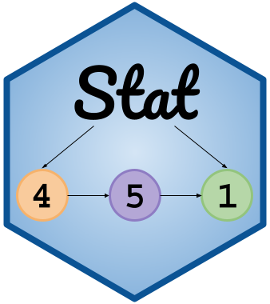

# Welcome! {.unnumbered}

{width="300" fig-align="left"}

This is the course website for Causal Inference (STAT 451) taught by Professor [Leslie Myint](https://www.lesliemyint.org) at Macalester College for Fall 2026.

  

*Note that this page will be under active construction throughout the semester.*

*If you find any typos or other issues, please email [lmyint@macalester.edu](mailto:lmyint@macalester.edu).*

 
 

 This work is licensed under a <a rel="license" href="http://creativecommons.org/licenses/by-nc-sa/4.0/">Creative Commons Attribution-NonCommercial-ShareAlike 4.0 International License</a>.

