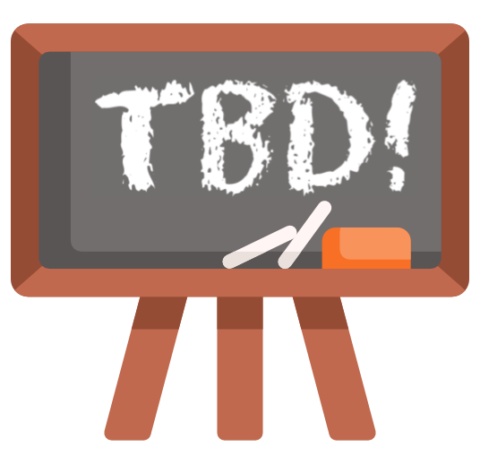

# Syllabus {.unnumbered}

## 🗺️ Course overview

We as individuals and organizations are constantly making decisions to improve some aspect of our lives and operations. Causal inference is a field devoted to quantifying the impact of such decisions. Fundamentally, it is dedicated to answer questions of "What if?" and "Should we?".

### 🎯 Learning goals

I hope that by the end of the course, you are able to:

- Explain the goals of causal inference to general audiences
- Formulate strategies for identifying causal effects that draw on causal graph methodology, study designs, and data context
- Analyze data with appropriate methodology to estimate causal effect, and communicate the results and limitations of an analysis to general audiences
- Conduct simulation studies to explore the properties of statistical methods
- Communicate the intuition/ideas behind causal inference methods to general audiences
- Recognize the potential for applying causal inference ideas in daily life
- Articulate with greater clarity key insights about your process for learning challenging topics and about the way in which you collaborate with others

### 📋 Topics

Tentatively, we will explore the following topics throughout the semester:

- Potential outcomes framework
- Causal graphs / graphical causal models
- Study designs and analytical approaches: randomized experiments, target trial framework, matching, regression discontinuity, event studies/interrupted time series, synthetic control, difference-in-differences, instrumental variables, propensity score and weighting methods, doubly robust estimators
- Causal discovery
- Sensitivity / robustness analyses

::: {.callout-note title="A letter from your instructor"}
Dear students,

This is a course that is dear to my heart, and I'm excited to rediscover the fascinating tools of this field with you.

As a graduate student, I actually worked in a completely different area for my dissertation. I focused on studying data from biological technologies (mass spectrometers and sequencing machines) and developing methods to analyze that data.

It was a happy and fortuitous occasion that I decided to take the course Causal Inference in Public Health during my 3rd year. I was immediately drawn in by the goals, tools, and application areas of the field---causal inference researchers really seemed to be studying meaningful and impactful issues. While I had little time to explore more of causal inference for the remainder of my graduate studies, the fascination stuck with me.

When I got to Macalester in 2018, the possibility of engaging more with causal inference opened up. I taught the first version of this course in Spring 2019 and have been steadily learning more over the years, improving this course along the way. I hope that you find ideas that intrigue you and applications that excite you.

Let's have a great semester!
:::

    

## ✉️ Course communication

### Contacting the instructor

**Instructor:** Leslie Myint (lez-lee mee-int) (she/her)

**About me:** Outside of teaching statistics and data science at Mac, I work as the Policy and Research Director for the MN Environmental Justice Table. I am passionate about waste reduction, clean energy, transportation, and the justice issues that touch these areas. In my free time, I like going on walks with my family, volunteering, coloring, sketch journaling, playing board and video games, and staying active by weightlifting and dancing.

 

::: {.callout-note title="Call me \"Leslie\""}
Students sometimes wonder what to call their professors. I prefer to be called Leslie (lez-lee), but if you prefer to be more formal, I am also ok with Professor Myint (mee-int). My preferred gender pronouns are she/her/hers.

Please help me make sure that I call you by your preferred name and pronouns too!
:::

#### Email

Please email me ([lmyint\@macalester.edu](mailto:lmyint@macalester.edu)) with any personal or academic concerns. I will do my best to respond within 24 hours on weekdays and 48 hours on weekends. For content questions, I encourage you to post in our [Google Chat space](https://chat.google.com/room/AAQA0MsQDTE?cls=7) (see below).

#### Office hours

**Why**: Office hours (drop-in hours / student hours) are a great time to talk about this class, career planning, or life in general. I love getting to know you outside class time, so please come chat! You should plan to attend my office hours at *least once* in the semester. If these office hour times don't work with your schedule, I'm available by appointment---email to set up a time to meet!

**Where**: OLRI 232 (towards the end of the 2nd floor hallway close to the Leonard Center)

**When**: See my [Office Hours Google Calendar](https://calendar.google.com/calendar/embed?src=macalester.edu_fglbnus5ogqs4rhrasel4jfj0c%40group.calendar.google.com&ctz=America%2FChicago) for up-to-date office hour times.

### Google Chat discussion board

We will use [this Google Chat space](https://chat.google.com/room/AAQA0MsQDTE?cls=7) for announcements and discussions that benefit the entire class. To streamline communication, I will *not* use the Moodle Announcements forum to post announcements.

Please check the GChat space daily!

    

## ⭐️ Guiding values

### Community is key

A sense of [community](https://www.educause.edu/research-and-publications/books/learning-spaces/chapter-4-community-hidden-context-learning) and connectedness can provide a powerful environment for learning: Research shows that learning is maximized when students feel a sense of belonging in the educational environment (e.g., Booker, 2016). A negative climate may create barriers to learning, while a positive climate can energize students' learning (e.g., Pascarella & Terenzini, cited in How Learning Works, 2012).

For these reasons, I design our in-class group activities to intentionally foster community and connectedness. You can help cultivate our classroom community by being thoughtful about the way you engage with others in class.

### Active listening is vital

Research on learning theory and how the brain works has taught us that people learn best in community, when they feel safe, seen, **heard**, and cared about. Effective listening is a key part of this process.

How often do you find yourself coming up with a response and waiting to interject rather than listening to what an other person is saying? On the flip side, what do you need to feel heard and understood?

To feel connected in community, we need to practice **turn-taking** and **active listening** (*fully engaged and trying to understand what someone is saying, rather than just listening to respond*). I will ask you to discuss how you want to be listened to throughout the semester.

### Reflection is paramount

The *content* you learn will be cool (unbiased opinion!), but it is a **guarantee** that as technology evolves, some part of it will become out-of-date during your careers. What you will need to rely on when you leave Macalester is what I want to ensure you cultivate now: learn how to learn. And the cornerstone of a good learning process is **reflection**.

Reflection is not just fundamental to learning content--it's fundamental to learning any sort of intellectual, emotional, or physical skill. For this reason, I am prioritizing reflection as a goal for our course in both content learning and collaborative activities.

### Mistakes are essential

> An expert is a person who has made all the mistakes which can be made in a narrow field.
> 
> - *Niels Bohr, Nobel Prize-winning physicist*

I don't feel comfortable working with a new R package until I've seen the same errors over and over again. Seeing new errors helps me understand the constraints of the code and the assumptions that I was making about my data.

In a course like this, we will all be making mistakes daily! But in so doing, we will be growing and honing our expertise.

### Communication is a superpower

> The single biggest problem in communication is the illusion that it has taken place.
>
> - *George Bernard Shaw*

Every time I go to a conference talk on a technical topic, it is striking how quickly laptops or phones come out because of the inability to follow. Academics notoriously struggle to make ideas accessible to others.

I want communication to be very different for you.

Every time you communicate ideas--whether through writing, visuals, or oral presentation--I want you to be a total boss. The end product of strong communication is a better experience for all those who have given you their attention. What's more, the *process* of crafting effective communication is invaluable for deepening your own understanding.

<blockquote class="twitter-tweet">
Read to collect the dots, write to connect them <a href="https://t.co/YbgnKKFUNn">pic.twitter.com/YbgnKKFUNn</a>
&mdash; David Perell (@david_perell) <a href="https://twitter.com/david_perell/status/1411871612702543872?ref_src=twsrc%5Etfw">July 5, 2021</a></blockquote> 

    

## 🌿 How to thrive and what to expect

When taking a new course, figuring out the right workflow/cadence of effort throughout the week can be a big adjustment. And most of you are doing this for 4 different courses! Below are some suggestions for what to expect in the course and how to focus your time and attention during and outside of class.

### Before class

**✏️&nbsp;&nbsp;&nbsp;Plan ahead**

In a typical week, plan to spend **8-10 hours** on this course (or any 4-credit course), including class time.

- If you are working far more or far less than 8 hours per week, let me know.
- Carve out dedicated time on your calendar for intentionally studying/reviewing and working on assignments.
- Stay up-to-date on the course calendar. The [website version](schedule.qmd) contains detailed information about our day-to-day, including resources. The Google calendar at the top of our Moodle page just contains due dates---this one might be helpful to incorporate into your personal Google calendar.

### During class

**✅&nbsp;&nbsp;&nbsp;Do the things**

Class time will be a mix of interactive lecture and longer stretches of group work. During the lecture portion, I will pause explanation frequently to prompt a short exercise or ask questions that you'll reflect on individually or together.

- Attend class and actively engage
- Work with your classmates; ask each other questions; share your ideas
- Complete the in-class activities (this might entail finishing outside of class)
- Jot down reflections about your learning process and how group work is going as they occur to you during class
- Review these reflections before class to frame how you want to engage in class. (Perhaps you've noticed a struggle and want to try a new strategy.)

### After class

**🧠&nbsp;&nbsp;&nbsp;Reflect** 

Make sure to take the time to finish the activity, and review the solutions *after* you have attempted all the exercises.
<!-- Most class days will have an associated Moodle checkpoint to draw attention to important concepts covered in the previous class. -->
After/during these efforts, reflect and ask yourself:

- What was easy? Why?
- What did I struggle with or need to work a little harder to remember? Why?

**📖&nbsp;&nbsp;&nbsp;Review** 

Most class periods will involve working with a new tool and computational concept. Alongside reflection, you can:

- Rewrite / organize your notes
- Summarize concepts in your own words

**🔎&nbsp;&nbsp;&nbsp;Be curious** 

Don't be afraid to ask questions. These are opportunities to learn and dig deeper. You get out what you put into a course. 

::: {.callout-tip title="Other suggestions"}
- Open the checkpoint on Moodle as you review the material. Jot down questions or ideas that you have about topics in the material.
- Ask (and answer!) questions in our [Google Chat space](https://chat.google.com/room/AAQA0MsQDTE?cls=7).
- Record any reflections from in-class time about your learning process or interactions with peers while they are still fresh.
- After learning a new topic in class, it is helpful to immediately attempt the related exercises on the upcoming homework assignment.
- Come to instructor office (drop-in) hours to chat about the course or anything else! 😃
:::

    

## ✏️ Grading and feedback

### My philosophy

Grading is a thorny issue for many educators because of its [known negative effects on learning and motivation](https://www.ncbi.nlm.nih.gov/pmc/articles/PMC4041495/). Nonetheless, it is ever-present in the US education system and at Macalester. Because I am required to submit grades for this course, it's worth me taking a minute to share my philosophy about grading with you.

What excites me about being a teacher is *your learning*. Learning flourishes in an environment where you find **meaning and value** in what we're exploring, feel **safe engaging with challenging things**, receive **useful feedback**, and **regularly reflect** on your learning.

It is important to me to create a course structure and grading system that creates an environment for learning to flourish:

- **Finding meaning and value:** I am striving to achieve this by creating space for authentic connection between you, your peers, and myself and by encouraging you to make connections between your interests and course ideas.

- **Safety in engaging with challenges:** The assignments and activities that we will use to learn are *meant to be challenging*, and it would be unreasonable for me to expect that you perform perfectly on the first try. For this reason, there are opportunities to **revise and reattempt without penalty** across assignments and assessments. I hope that this significantly reduces stress. If ever you are feeling overwhelmed by this course, please reach out to me. We'll find a way to make things more manageable.

- **Receiving useful feedback and reflecting regularly:** In order to learn maximally by pursuing a revision, you need BOTH good feedback and to reflect thoughtfully about misconceptions in your learning. Our preceptors and I will strive to give useful comments and prompts to spur reflection when we see room for improvement. 

### Assignments and assessments

**Assignments:** Roughly every 1-2 weeks, there will be an out-of-class assignment containing problems and exercises meant to reinforce key concepts from class.

**Notes-free, in-person assessments:** We will have 1 or 2 in-person (rather than asynchronous/take-home) assessments completed without the aid of notes. I would like to decide on what these are based on your input. Some possibilities include:

- In-class exam
- Oral content discussion with instructor (structured as a mock job interview, for example)

I'm open to other ideas! Much like an athlete tests their skills by playing in a match or a musician through a recital, I would like this assessment to provide a genuine context for you to show your learning. It's possible that everyone chooses different options, and this is ok with me. I will seek input from you about what you might want this to look like.

**Project:** As a 400-level MSCS capstone, this course has a substantial project component, which you must pass to pass the course.

- If you are an MSCS major, you are required to complete at least one 400-level course, thus at least one capstone project, in your major before spring of your senior year.
- You will choose one of these completed projects to later present on MSCS Capstone Days during your senior year (Fall for December graduates and Spring for May graduates).
- Full details about the project will be available on our course website's [project page](../project.qmd).

**Seminar attendance:** Because this is a capstone course, you are required to attend and subsequently submit a short reflection for at least 2 MSCS seminars, or other related presentations upon instructor approval.

### Course grading system

{width=300}

I have been experimenting with different grading systems for 6 years, and it's always been difficult to design them without knowing who you are, how you learn, and what motivates you.

To this end, I'd like to start by learning more about you so that collectively, we can design a fair and motivational system that we can all agree on.

[Assignment 1](../hw/assignment1.qmd) will be a short piece of writing that will help me learn about you in this regard. I'll use insights from your writing to structure our process for coming to a consensus over the course of the semester.

As a starting point, I do think it's helpful for me to share my specific values with regards to this class. I would have no reservations giving an "A" to students who:

- Consistently show up to class prepared and engage in class with good-faith efforts
- Consistently uplift and support classmates' learning
- Never make classmates feel uncomfortable, unwelcome, or "less than" in any way
- Consistently reflect and act on feedback to improve
- Demonstrate complete understanding of core concepts
- Put in the work to create a quality final project
- Respect our course's stance on AI (see [section on AI](#artificial-intelligence) below)

::: {.callout-tip appearance='simple' icon=false title="The big picture"}
At this point, it's worth repeating that **I care most about your long-term learning**, particularly because I believe that our course ideas are useful and empowering. My hope with our course design and grading system is that I am providing you with the right experiences for practice and reflection that will make our ideas and skills stick for the long-term.

View me as your coach. I'm here to support you and get you to where you want to be.
:::

    

## 📚 Textbooks

We will primarily use the following references (freely available online):

- Required readings will generally come from *The Effect: An Introduction to Research Design and Causality* by Nick Huntington-Klein. This book is freely available online [here](https://www.theeffectbook.net/index.html).
- Optional readings will generally come from *Causal Inference: The Mixtape* by Scott Cunningham. This book is freely available online [here](https://mixtape.scunning.com/).

The following textbooks are also good resources (also freely available online):

- **[PRIMER]**: Causal Inference in Statistics: A Primer, by Judea Pearl, Madelyn Glymour, and Nicholas P. Jewell. PDF freely available [online](http://bayes.cs.ucla.edu/PRIMER/).
- **[WHATIF]**: Causal Inference: What If, by Miguel A. Hernán and James M. Robins. PDF freely available [online](https://www.hsph.harvard.edu/miguel-hernan/causal-inference-book/).

References for review

- [STAT 155 Notes](https://mac-stat.github.io/Stat155Notes/): An online set of notes for STAT 155 written by the Macalester statistics faculty.
- [Probability Essentials](https://youtu.be/acofPsJDq5Y): A YouTube video outlining some key ideas from probability. Not required material to know but useful if you want a reference on probability details.
- [This article](https://medium.com/@EpiEllie/having-confidence-in-confidence-intervals-8f881712d837) by Eleanor Murray has a great explanation of the most common misinterpretation of confidence intervals.

    

## 🪧 Other policies

### Absences

Being together in class to learn in community with others is a rare and valuable resource. For this reason, I highly encourage attending class, but I also understand that life circumstances may sometimes prevent attendance. I will be tracking attendance just to make sure that everyone is ok, and I will reach out if I'm concerned.

::: {.callout-note title="If you miss class"}
- Check the daily schedule for what is happening in class that day.
- Complete the in-class activity on your own.
- Ask any follow-up questions on our course Google Chat space or in office hours.
- Send me a quick email. You do not need to share a detailed reason for your absence. It's just a simple courtesy and keeps communication lines open.
:::

### Late work

Homework assignments will be due **roughly every 1-2 weeks on Thursdays at 11:59pm on Moodle**.

The purpose of deadlines are so that I can give useful, meaningful feedback in a timely manner. Everyone automatically has three 3-day extensions to use throughout the semester. **If you anticipate needing more time to complete an assignment and want to use one of those extensions, please email me ahead of time so that I can plan when I can give feedback.** 

*If you have used all of your extensions and need more time, please email me to set up a meeting as soon as possible to discuss your situation and to come up with a plan for thriving in the course.*

### Academic integrity

Academic integrity is the cornerstone of our learning community. Students are expected to be familiar with the [college's standards](http://www.macalester.edu/academicprograms/academicpolicies/academicintegrity/) on academic integrity.

I encourage you to work with your classmates to discuss material and ideas for assignments, but in order for you to receive individualized feedback on your own learning, you must submit your own work. This involves writing your own code and putting thoughts and explanations into your own words. Always cite any sources you use, including AI (see section below).

### Artificial intelligence

As a society, we are paying a lot of attention to AI. Some fear its use from ethical, environmental, and existential standpoints. Some are focused on gaining AI skills that employers are increasingly advertising as being necessary for new hires.

For our experience together, my main concern is how AI impacts your learning. My experience over the last few years has shown me that when the (perceived) quality of a **product** (a homework assignment, a report, code, etc.) is the main focus, AI tends to hinder learning because there is an overemphasis on just getting a good product (at least one the instructor will hopefully think is good) rather than becoming the kind of person who can create a good product. In contrast, when the **process** (effort) of learning is the focus, AI is more likely to aid learning.

My hope for you by the end of the semester is *not* that you have done well on all your assignments and completed a fantastic project. My hope is that you have *become the kind of person* who has the skills to perform at that level again and who uses those skills to meaningfully benefit those who have entrusted you with work.

That said, our academic system requires me to assess this goal. And I can only really do that by looking at products of your learning process. I'll be honest that there are likely 

For this reason, I am asking you to **never use generative AI as a complete replacement for your own thinking.**

- If you need to turn in work for feedback and are completely stuck, I ask that you do not use text from AI as a response.
    - Instead, please tell me what *specifically* you didn't understand or were having trouble with.    
    > **Example:** I couldn't complete Exercise 2 because I don't understand how to translate the process of interpreting an interaction coefficient with one categorical and one quantitative variable to one with two quantitative variables.
    - Please also seek out help from me or your peers ahead of time, and we can work together to get you unstuck!

AI can be helpful in explaining concepts in new ways and providing other examples. If you use AI in this way, **please copy and paste both your prompt(s) and the AI output into your assignment.**

- This is helpful to me to understand how I can improve the course materials!

::: {.callout-tip title="Environmental impact of AI" icon=false}
Because of my work in environmental justice, it is important to me to name AI's environmental impacts:

- The building and usage of AI tools consume enormous amounts of energy (see [here](https://www.nature.com/articles/s42256-020-0219-9) and [here](https://www.cfr.org/blog/artificial-intelligences-environmental-costs-and-promise)) and water (see [here](https://www.eesi.org/articles/view/data-centers-and-water-consumption)).
- In Minnesota, data center builders have been acting unethically, trying to skirt environmental review and hide environmental impacts from the residents of impacted communities (see [here](https://www.mncenter.org/data-centers)).
:::

    

## ☀️ The environment you deserve

Macalester College values diversity and inclusion. We are committed to a climate of mutual respect, free of discrimination based on race, ethnicity, gender identity, religion, sexual orientation, disability, and other identities, in and out of the classroom. This class strives to be a learning environment that is usable, equitable, inclusive, and welcoming.

To help support these goals, we expect you to follow the [MSCS Community Guidelines](https://docs.google.com/document/d/e/2PACX-1vSlLLWmyOf8WKGDKJ_qypgA_kQI1dNFGEKH0mtFoqfAUARZN7ypVCgivnmPjccks9jJzW1rgEzt7QMI/pub). These guidelines were created by the MSCS faculty and staff in our ongoing efforts to create a community that is more welcoming, supportive, and inclusive.

**Respect:** Everyone comes from a different path through life, and it is our moral duty as human beings to listen to each other without judgment and to respect one another. I have no tolerance for discrimination of any kind, in and out of the classroom. If you are seeking campus resources regarding ongoing microagressions, the [Department of Multicultural Life](https://www.macalester.edu/multiculturallife/) and the [Center for Religious and Spiritual Life](https://www.macalester.edu/religiouslife/) are wonderful resources.

**Empathy:** Everyone has a different life situation. This will impact our personal choices, and it can cause tension. Please start with empathy for each other. We all have ongoing struggles and worries, and we are all trying to do our best given the circumstances.

**Curiosity:** We are dealing with higher than normal levels of anxiety, and all of us have different ways of coping with that stress. As we navigate interpersonal relationships, start with curiosity. Rather than assuming, ask each other questions.

**Sensitive Topics:** Data science applications span issues in science, policy, and society. As such, we may sometimes address topics that are sensitive for you. I will try to announce in class if an assignment or activity involves a potentially sensitive topic. If you have reservations about a particular topic, please come talk to me to discuss possible options.

**Accommodations:** If you need accommodations for any reason, please contact [Center for Disability Resources](https://www.macalester.edu/disability-resources/students/) to discuss your needs, and speak with me as soon as possible afterwards so that we can discuss your accommodation plan. If you already have official accommodations, please discuss these with me within the first week of class so that you get off to a great start. Contact me if you have other special circumstances.

**Title IX:** You deserve a community free from discrimination, sexual harassment, hostility, sexual assault, domestic violence, dating violence, and stalking. If you or anyone you know has experienced harassment or discrimination, know that you are not alone. Macalester provides staff and resources to help you find support. More information is available on the [Title IX website](https://www.macalester.edu/titleix/).

Please be aware that all Macalester faculty (and preceptors when working) are mandatory reporters, which means that if we become aware of incidents or allegations of sexual misconduct, we are required to share the matter with the Title IX Coordinator. Although I have to make that notification, you control how your case is handled, including whether or not you wish to pursue a formal complaint. If you would like to speak to someone confidentially, contact the Hamre Center (651-696-6275), Chaplain staff (651-696-6298), or other local and national resources [listed here](https://www.macalester.edu/title-ix/find-support/).

**Food Access:** Macalester's [Food Access](https://www.macalester.edu/community-engagement/food-access/) page lists several resources for accessing free/affordable health food. One additional resource is the Extra Eats app which is available within Mac Nav (you need to be signed in to Mac Nav to see it). If you need extra resources, please don't hesitate to ask me.

**General Health and Well-being:** I care that you prioritize your well-being in this semester and beyond. Investing time into taking care of yourself will have profound impacts on all aspects of your life. Remember that beyond being a student, you are a human being carrying your own experiences, thoughts, emotions, and identities. It is important to acknowledge any stressors you may be facing, which can be mental, emotional, physical, cultural, financial, etc., and how they can have an impact on you. I encourage you to remember that you have a body with needs. In the classroom, eat when you are hungry, drink water, use the restroom, and step out if you are upset and need some air. Please do what is necessary so long as it does not impede your or others' ability to be mentally and emotionally present in the course. Outside of the classroom, sleeping well, moving your body, and connecting with others can be strategies can help nourish you. If you are having difficulties maintaining your well-being, please don't hesitate to contact me and/or find support from campus physical and mental health resources:

- [Support Resources for Students with Disabilities](https://docs.google.com/document/d/1lz-ii5yze_OSkQJqz_7pap7fRjG81LJh0_saBniP-zg/edit)
- [Health and Wellness Resources
](https://docs.google.com/document/d/1iC-ykD8QJ-w2BVO1Gb0AobD-00Zq_8mznWR5C2mNiF0/edit?usp=sharing)
- [Help for Current Students](https://www.macalester.edu/current-students/)
